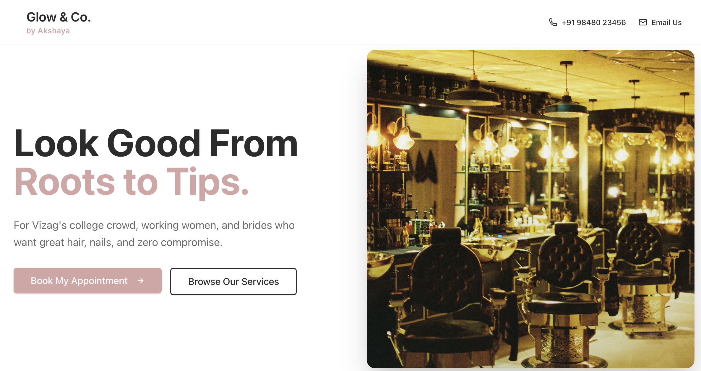
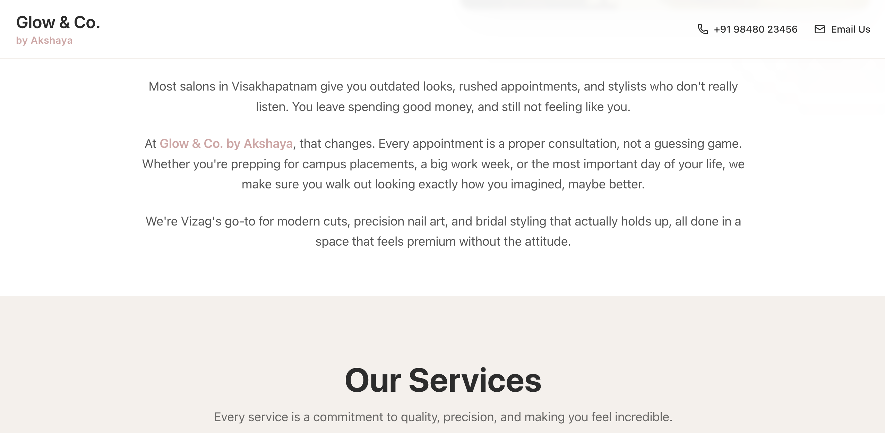
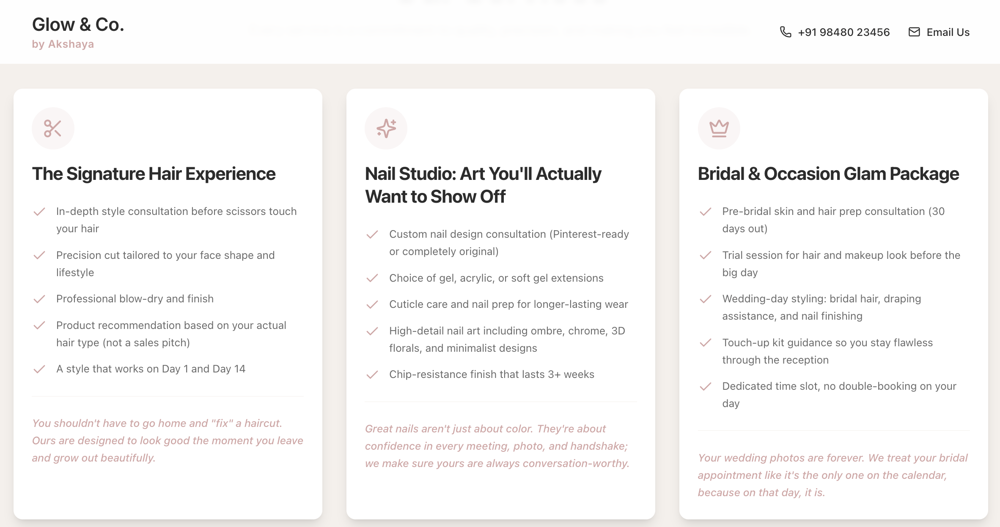
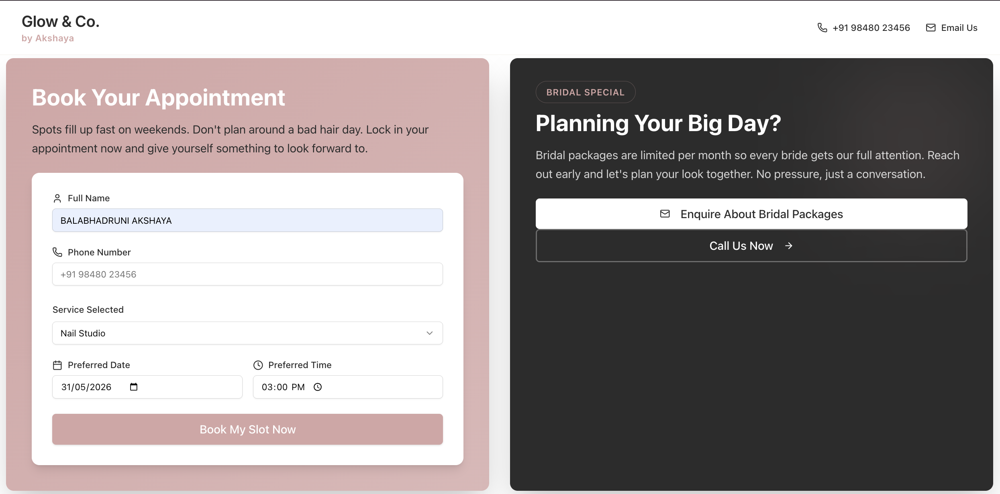
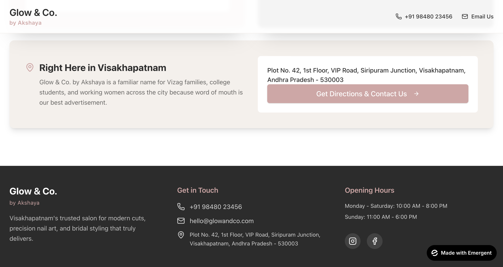

# FUTURE_PE_01
# Task 1: AI Website Copy Generator for Local Businesses

## 📌 Project Overview
Most local service businesses lose potential clients not because their services are lacking, but because their digital storefronts feature unclear copy, vague value propositions, and confusing calls-to-action. 

This project solves that exact problem by establishing a structured, highly reusable **Prompt Engineering Framework** deployed side-by-side with conversational AI web-building platforms. Using targeted persona assignment, explicit design rules, and contextual variables, this system generates conversion-focused, website-ready copy and sleek user interfaces without relying on expensive copywriting agencies.

---

## 🏢 Chosen Business Profile: Glow & Co. by Akshaya
*   **Business Category:** Premium Aesthetic Hair, Nail, & Bridal Salon
*   **Geographic Focus:** Visakhapatnam (Vizag), Andhra Pradesh, India
*   **Target Demographics:** College students (campus placement prep), busy working professionals, and modern bridal clients.
*   **Core Tone Strategy:** Friendly, welcoming, and highly relatable, balanced with a confident, premium, and professional edge with zero attitude.

---

## 💡 Prompt Engineering Logic & Strategy
The master prompt was engineered following strict structural guidelines to maximize conversion rate optimization (CRO) while avoiding typical AI text pitfalls:

1. **Role & Persona Assignment:** The AI is explicitly assigned the role of an *"elite Conversion Copywriter and CRO expert."* This primes the model to prioritize conversion metrics over poetic, wordy text.
2. **Context & Variable Isolation:** By segmenting the Business Name, Location, Target Audience, and Tone into specific block variables, the prompt remains entirely **reusable** for other future local business clients (e.g., changing the variables instantly updates the system for a local cafe or medical clinic).
3. **Negative Constraints (AI Fluff Banning):** To achieve a highly professional, human-written feel, the prompt explicitly bans standard "AI-isms" (e.g., *nestled in the heart of, elevate your experience, testament to luxury*).
4. **Benefit-Driven Hierarchy:** Every generated service block mandates a shift from features (what the salon does) to concrete benefits (how the client looks, feels, and saves time).

---

## 🛠️ Production Tools & Development Process
*   **Core LLM Prompting:** Claude 3.5 Sonnet / ChatGPT (used for initial prompt testing and refining raw outputs).
*   **UI Layout & Deployment Engine:** Emergent AI (used to co-create the visual landing page sections based on layout text parameters).
*   **Version Control:** GitHub

### 💬 The Interactive AI Chat Log Workflow
The user interface was iteratively refined during the Emergent AI build phase by systematically handling core development questions:
*   **Contact Configuration:** Mapped functional hyper-local contact points (`+91 98480 23456` and `hello@glowandco.com`) into the universal site header.
*   **Asset Sourcing:** Integrated a warm-toned, atmospheric salon interior stock photo on the right side of the split Hero layout.
*   **Architecture Choice:** Deployed a hybrid single-page format featuring clear static informational copy combined with an active frontend lead-capture booking form backend.
*   **Identity System:** Generated a clean typographic logo header reading *"Glow & Co. by Akshaya"* to maintain design minimalisms.

---

## ⚙️ The Master UI & Layout Generation Prompt
Below is the exact execution prompt utilized within the AI generation layer to yield the finalized layout, asset distribution, typography hierarchy, and style palette:

MASTER PARAMETRIC PROMPT: LOCAL BUSINESS WEBSITE GENERATOR

ROLE & CONTEXT
Act as an elite Conversion Copywriter and Conversion Rate Optimization (CRO) expert specializing in localized retail and service industries. Your task is to generate high-converting, website-ready copy based on the specific business variables provided below.

VARIABLES
- Business Name: "Glow & Co. by Akshaya"
- Location Focus: "Visakhapatnam (Vizag), India"
- Business Type: "Premium Aesthetic Hair, Nail, & Bridal Salon"
- Target Audience: "Vizag's college crowd looking for sharp styling, busy working women, and modern brides wanting long-lasting elegance."
- Desired Tone: "Friendly, welcoming, trendy, yet deeply professional and premium with zero attitude."

CONSTRAINED RULES
1. Explicitly ban generic AI-fluff phrases (e.g., "nestled in the heart of," "testament to luxury," "elevate your experience," "ultimate destination"). Use punchy, authentic, everyday language.
2. Focus strictly on benefits over features. Don't just explain what a service does; explicitly state the immediate and long-term confidence it gives the customer.
3. Inject specific regional/demographic trust points to hook local clients.

REQUIRED OUTPUT SECTIONS
### SECTION 1: HOMEPAGE (HERO & INTRO)
- Hero Headline (Clear value proposition, under 10 words)
- Hero Sub-headline (Audience targeting + benefit + local hook)
- Primary & Secondary CTA button labels
- Short Intro Section

### SECTION 2: SERVICES PAGE CONTENT
Generate exactly 3 core services tailored to the business type. Include service name, clean bullet points of deliverables, and a 1-sentence "Why Choose Us" outcome.

### SECTION 3: CALL-TO-ACTION (CTA) SECTIONS
Provide three distinct variants: Direct Booking Focus, High-ticket Bridal Inquiry Focus, and Location/Community Trust Focus.

---

## 📄 Final Generated Outputs & Copy Set

### 🏠 1. Homepage Section
*   **Hero Headline:** Look Good From Roots to Tips.
*   **Hero Sub-headline:** For Vizag's college crowd, working women, and brides who want great hair, nails, and zero compromise.
*   **Primary CTA Button:** Book My Appointment
*   **Secondary CTA Button:** Browse Our Services
*   **Intro Section Text:** Most salons in Visakhapatnam give you outdated looks, rushed appointments, and stylists who don't really listen. You leave spending good money — and still not feeling like you. At Glow & Co. by Akshaya, that changes. Every appointment is a proper consultation, not a guessing game. Whether you're prepping for campus placements, a big work week, or the most important day of your life — we make sure you walk out looking exactly how you imagined, maybe better. We're Vizag's go-to for modern cuts, precision nail art, and bridal styling that actually holds up — all done in a space that feels premium without the attitude.

### 💇 2. Services Page Content
*   **Service 1 — The Signature Hair Experience**
    *   **What's Included:** In-depth style consultation before scissors touch your hair; Precision cut tailored to your face shape and lifestyle; Professional blow-dry and finish; Product recommendation based on your actual hair type (not a sales pitch); A style that works on Day 1 and Day 14.
    *   **The "Why Choose Us" Benefit:** You shouldn't have to go home and "fix" a haircut — ours are designed to look good the moment you leave and grow out beautifully.
*   **Service 2 — Nail Studio — Art You'll Actually Want to Show Off**
    *   **What's Included:** Custom nail design consultation (Pinterest-ready or completely original); Choice of gel, acrylic, or soft gel extensions; Cuticle care and nail prep for longer-lasting wear; High-detail nail art including ombre, chrome, 3D florals, and minimalist designs; Chip-resistance finish that lasts 3+ weeks.
    *   **Why Choose Us:** Great nails aren't just about color — they're about confidence in every meeting, photo, and handshake; we make sure yours are always conversation-worthy.
*   **Service 3 — Bridal & Occasion Glam Package**
    *   **What's Included:** Pre-bridal skin and hair prep consultation (30 days out); Trial session for hair and makeup look before the big day; Wedding-day styling: bridal hair, draping assistance, and nail finishing; Touch-up kit guidance so you stay flawless through the reception; Dedicated time slot — no double-booking on your day.
    *   **Why Choose Us:** Your wedding photos are forever — we treat your bridal appointment like it's the only one on the calendar, because on that day, it is.

### 🚀 3. CTA Sections
*   **Variant A — Book Now:** Spots fill up fast on weekends. Don't plan around a bad hair day — lock in your appointment now and give yourself something to look forward to.
    *   **Button:** Book My Slot Now
*   **Variant B — Contact & Inquiry Focus (High-Ticket / Bridal):** Planning a wedding or a big event? Bridal packages are limited per month so every bride gets our full attention. Reach out early and let's plan your look together — no pressure, just a conversation.
    *   **Button:** Enquire About Bridal Packages
*   **Variant C — Location Trust:** Right here in Visakhapatnam. Glow & Co. by Akshaya is a familiar name for Vizag families, college students, and working women across the city — because word of mouth is our best advertisement. Easy to find, easier to love.
    *   **Button:** Get Directions & Contact Us

---

## 🖼️ Visual Web Layout Execution
The framework cleanly mapped out a high-converting, highly accessible interface using a professional warm cream, nude, and soft terracotta pink palette. 

### 1. Hero Section Interface

### 2. Narrative Intro Component

### 3. Structural Services Breakdown

### 4. Interactive Booking Form & Direct Lead Capture

### 5. Local Trust Matrix & Footer Navigation

---
*Developed as part of the Future Interns Prompt Engineering Track (Track Code: PE).*
